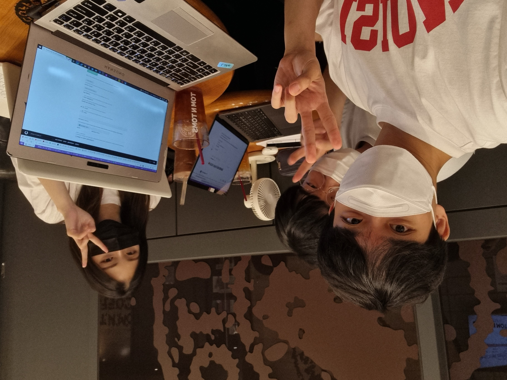

:::info

**시간** : 2022-07-06 19:30 ~ 22:30

**장소** : 탐앤탐스

**내용** : 모각소 첫 모임

:::

---

각 멤버는 다음과 같은 **목표**를 가지고 스터디에 임했습니다.

### 하현수

- HTML / CSS 시작하기
- HTML / CSS 핵심개념
- [참고](https://velog.io/@skyhs990609/%EB%AA%A8%EA%B0%81%EC%86%8C-1%EC%A3%BC%EC%B0%A8-76-TIL)

### 박지영

- Git과 GitHub 시작하기 인프런 강의 시청
- [참고](https://github.com/MoGakSo-Ajou/Parkjiyoung/wiki/%EB%AA%A8%EA%B0%81%EC%86%8C-1%ED%9A%8C%EC%B0%A8-%EA%B2%B0%EA%B3%BC)

### 송재한

- 모각소용 TIL 제작
- 개인용 TIL 제작 (추후에 더 꾸밀 예정)
- 파란학기 '유클러버스' Storybook으로 디자인 정리
- [참고](http://localhost:3000/MoGakso-TIL/study)
