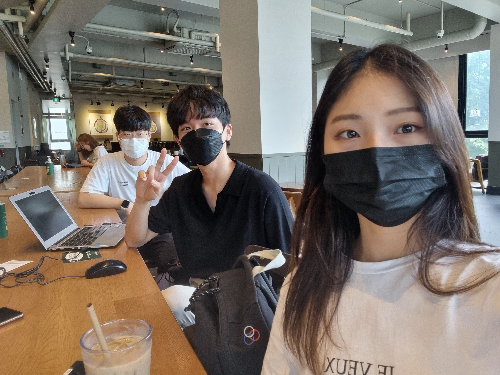

:::info

**시간** : 2022-07-20 10:00 ~ 13:00

**장소** : 스타벅스 아주대점

**내용** : 모각소 세 번째 모임

:::

---

각 멤버는 다음과 같은 **목표**를 가지고 스터디에 임했습니다.

### 하현수

- 이전 학습에서 배운 HTML/CSS 핵심개념 정리 및 응용

### 박지영

- <스프링 입문 - 코드로 배우는 스프링 부트, 웹 MVC, DB 접근 기술> 섹션2 - 섹션5 까지 강의 듣기

### 송재한

- JS 개념 공부 및 정리
