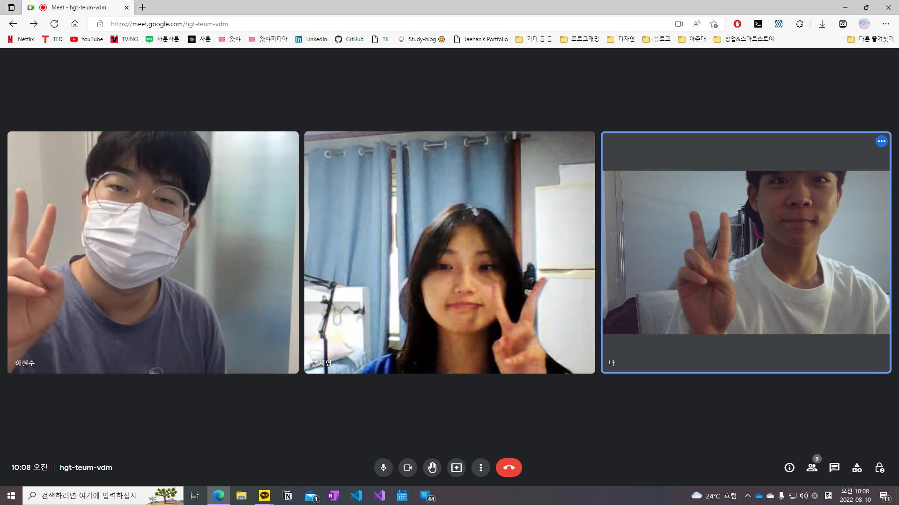

:::info

**시간** : 2022-08-10 10:00 ~ 13:00

**장소** : 비대면 (Google Meets)

**내용** : 모각소 다섯 번째 모임

:::

---

각 멤버는 다음과 같은 **목표**를 가지고 스터디에 임했습니다.

### 하현수

- HTML/CSS 핵심개념 정리 및 응용

### 박지영

- <스프링 입문 - 코드로 배우는 스프링 부트, 웹 MVC, DB 접근 기술> 섹션 5 강의 수강 완료

### 송재한

- 네이버 부스트코스 풀스택 강좌 듣기 (1강)
