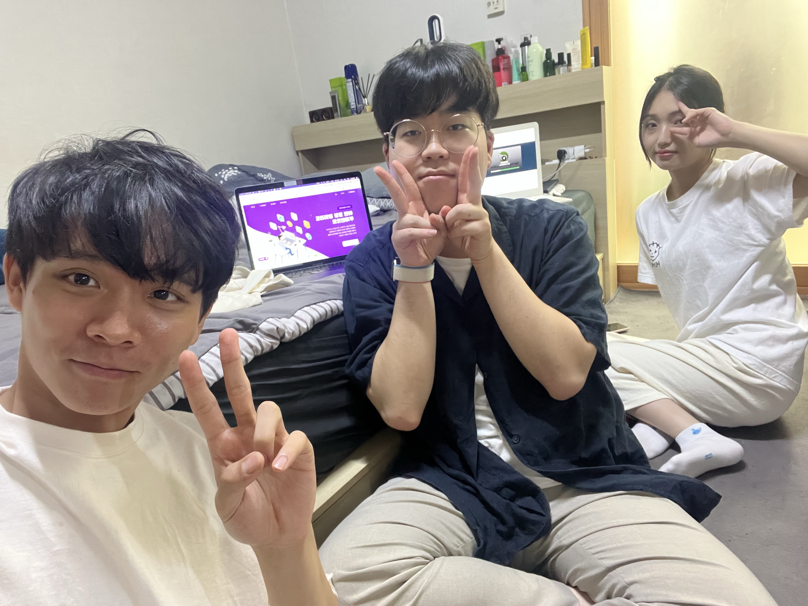

:::info

**시간** : 2022-08-25 20:00 ~ 23:00

**장소** : 대면 (자취방)

**내용** : 모각소 여섯 번째 모임

:::

---

각 멤버는 다음과 같은 **목표**를 가지고 스터디에 임했습니다.

### 하현수

- HTML/CSS 핵심개념 정리 및 응용

### 박지영

- <스프링 입문 - 코드로 배우는 스프링 부트, 웹 MVC, DB 접근 기술> 강의 수강 완료

### 송재한

- 네이버 부스트코스 풀스택 강좌 듣기 (1강 복습)
- 네이버 부스트코스 풀스택 강좌 듣기 (2강 정리)
