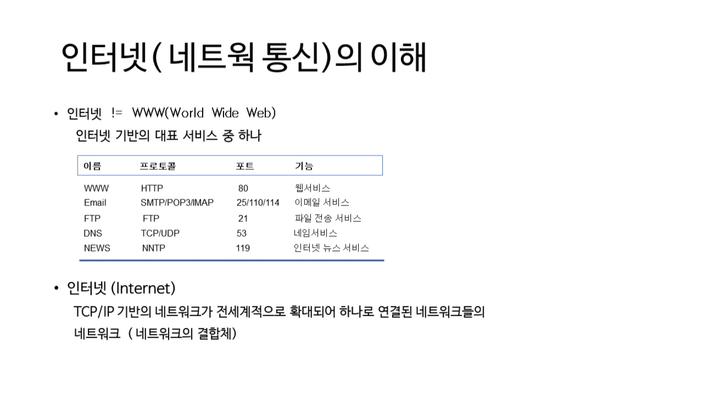
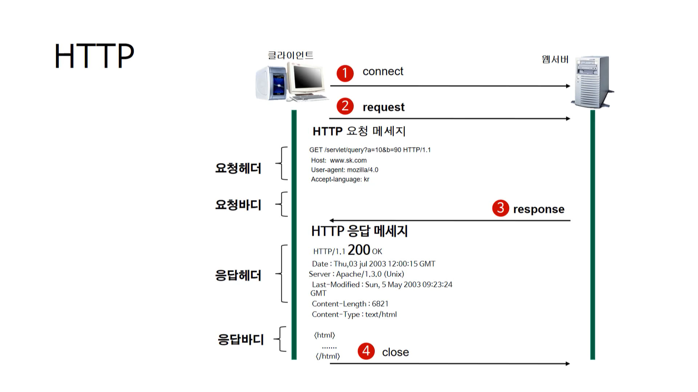
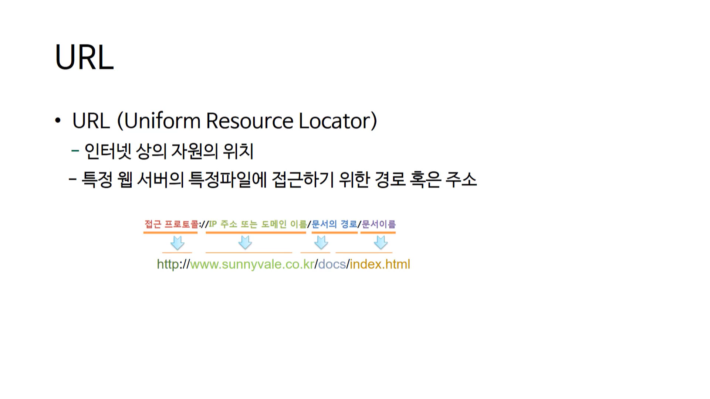

:::info

JS 공부 정리, 네이버 부스트코스 풀스택 강좌 듣기

:::

---

## Internet

- TCP/IP 기반의 네트워크가 전세계적으로 확대되어 하나로 연결된 네트워크들의 네트워크
  **(네트워크의 결합체)**

- 각 네트워크마다 **프로토콜과 포트**가 다르다



## HTTP

- Server와 Client가 인터넷상에서 데이터를 주고받기 위한 프로토콜이다.  
  (Client가 Server에게 **요청(request)**을 보낸 후, Server가 Client에게 **응답(response)**을 보낸다)
- **무상태 프로토콜**이라고도 불린다
  - 서로 데이터를 주고 받기 전, **Server**와 **Client**를 연결합니다.
  - Response와 Request가 진행된 후 바로 연결을 끊습니다. (개별적인 진행)
  - 다음 Response와 Request가 대상이 같을지라도 이전에 진행했던 대상과 같은지 알 수가 없습니다.

### 장점

- **불특정 다수**를 대상으로 하는 서비스에 적합하다  
  (클라이언트와 서버가 지속적으로 연결된 형태가 아니기 때문에 많은 Request와 Response를 처리할 수 있다)

### 단점

- 그냥 연결을 끊어버리기 때문에 Client의 **이전상황**을 알 수가 없다.
- 평문 통신 (암호화가 되어 있지 않은 통신)이기 때문에 보안에 취약
- 통신 상대를 확인하지 않기 때문에 위/변조가 가능

### HTTPS

- HTTP보다 보안이 추가된 프로토콜 (단점 보완)
- 개인정보와 관련된 사이트라면 HTTPS를 사용해야 한다.

### HTTP 요청/응답 과정



#### 1. HTTP 요청 메세지

```http
GET /servletquery?a=10&b=90 HTTP/1.1
...
```

- **Request Method** : GET (GET, PUST, POST, DELETE 등의 요청 방식 존재)
- **Request URI** : servletquery?a=10&b=90 (요청하는 자원의 위치를 명시)
- **Web Protocol Version** : HTTP/1.1 (웹 브라우저 사용하는 프로토콜 버전)

- Request Method 종류
  - GET : 정보를 요청하기 위해서 사용한다. (SELECT)
  - POST : 정보를 밀어넣기 위해서 사용한다. (INSERT)
  - PUT : 정보를 업데이트하기 위해서 사용한다. (UPDATE)
  - DELETE : 정보를 삭제하기 위해서 사용한다. (DELETE)
  - HEAD : (HTTP)헤더 정보만 요청한다. 해당 자원이 존재하는지 혹은 서버에 문제가 없는지를 확인하기 위해서 사용한다.
  - OPTIONS : 웹서버가 지원하는 메서드의 종류를 요청한다.
  - TRACE : 클라이언트의 요청을 그대로 반환한다. 예컨데 echo 서비스로 서버 상태를 확인하기 위한 목적으로 주로 사용한다.

#### 2. HTTP 응답 메세지

```http
HTTP/1.1 200 OK
...
```

- **Web Protocol Version** : HTTP/1.1
- **Response Code** : 200
- **Response Message** : OK

## URL

- 인터넷 상의 자원의 위치
- URL를 통해 **프로토콜, IP/도메인 이름, 문서의 경로, 이름**을 알 수 있다.



:::tip

- 하나의 물리적 컴퓨터에는 여러 개의 소프트웨어 서버가 동작할 수 있는데
  이 서버는 포트값이 다르게 동작해야한다  
  (0 ~ 65535) HTTP 포트값 : 80

:::

## 결과

:::note

- [x] 네이버 부스트코스 풀스택 강좌 듣기
- [ ] JS 공부 정리

:::
